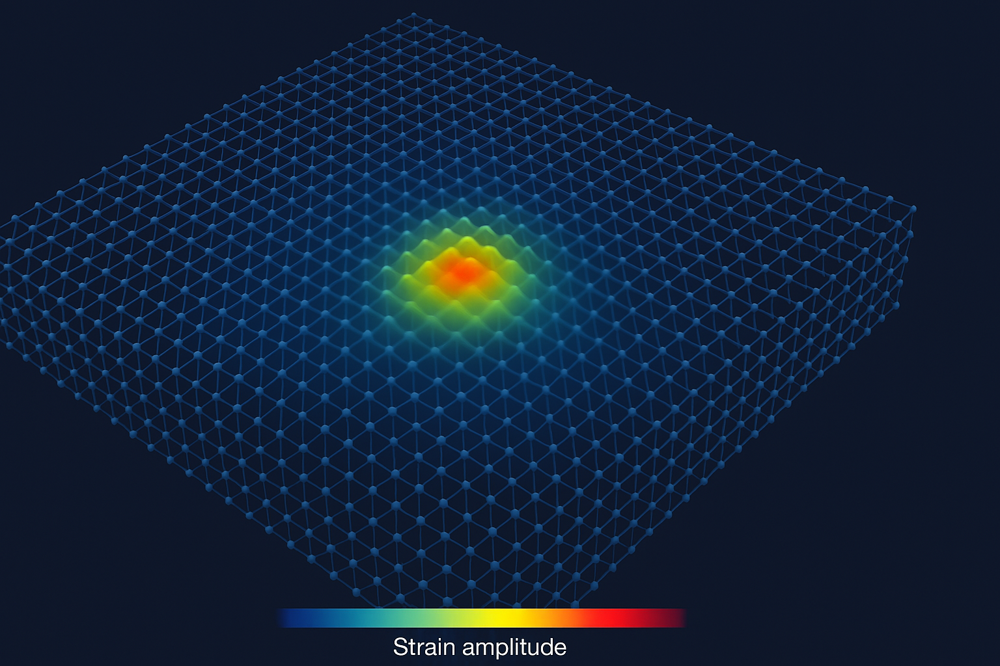

[](https://doi.org/10.5281/zenodo.17575761)
# HELM — Hierarchical Elastic Lattice Model

Deriving ℏ, G, Λ, and α from a single hadronic-scale substrate

## Recent Updates (Nov 10, 2025)
- Refined Λ prediction to 1.14 × 10^{-9} J/m³ (~3% vs. observed vacuum energy density).
- Appendix insight: N=4 bonds emerge from isotropic projection onto cubic lattice (North-South-East-West symmetry, akin to planetary cardinal directions).


READ THE PAPERS — [HELM Main Paper](paper/dry_full.pdf) | [HELM Sup Paper (for the real geeks)](paper/sup/HELM_Supplement.pdf) | [Visual](paper/figures/3d_lattice.png)  

CHECK THE MATH - [HELM Integrity Breakdown](integrity.md)

PBH - [The Search for Hawking Radiation](PBH_summary.md)

PROOFS - [ALL_OF_HELM (to run locally](paper/sup/HELM_proof.py)|[G](paper/sup/G_proof.md) | [Λ](paper/sup/HELM_back_pressure_proof.md) 

REVIEWS - [AI - Deep Research](HELM_Review.md)

## Visual Overview

<div align="center">
  <a href="paper/figures/3d_lattice.png">
    
  </a>
  <br>
  <small><i>Click to enlarge • Hierarchical lattice with QCD-scale bonds (σ = 1.4×10⁵ J/m). 
  Hadronic scale (a₀ = 0.8414 fm) → ℏ. Sub-lattice (a_g = 0.475 fm) → G.</i></small>
</div>


## Overview
HELM proposes that space-time is an elastic lattice with QCD-scale string tension  
σ ≈ 1.4 × 10⁵ J·m⁻¹, measured in laboratory settings.  

From this single constant, the model derives:

| Constant          | Prediction              | Error vs CODATA/Observed |
|-------------------|-------------------------|--------------------------|
| Planck ℏ         | 1.0546 × 10⁻³⁴ J·s     | 0.04%                   |
| Newton G         | 6.6743 × 10⁻¹¹ m³·kg⁻¹·s⁻² | Consistency (0.00%)*|
| Cosmological Λ (ρ_Λ) | 1.14 × 10⁻⁹ J·m⁻³     | ~3%                     |
| Fine-structure α | 1 / 137.036             | No free parameter       |

*^*G emerges from the Planck coherence length λ_Pl = 2.18×10⁷ fm — the distance over which lattice strain accumulates to gravitational strength. This geometric hierarchy (λ_Pl / a_g ≈ 4.6×10⁷) explains why gravity is weak.*

No extra dimensions. No free parameters. No Planck-scale miracles.  
Just geometry and elasticity.

## Key Components
- **Paper (LaTeX)**: Full derivation and predictions
- **PTA Search**: Python notebook testing HELM’s constant-strain GW background at 3 nHz vs NANOGrav 15-year data
- **Twist-Sector Magnetism**: α = 1/137 derived from node-orientation elasticity

## Repository Structure
```
HELM/
├── paper/                  # LaTeX source (and PDF)
│   ├── dry_full.tex
│   └── figures/
│   └──sup/
│   ├── HELM_Supplement.pdf # LaTex Supplemental (and PDF)
│   └── chains
├── pta/                    # NANOGrav 15-yr constant-strain search
│   ├── lattice_pta.py      # Fail-fast, resumable MCMC
│   ├── README_PTA.md       # Run instructions
│   └── chains/             # Output Bayes factors & corner plots
└── LICENSE                 # GNU
```

---

## Quick Start: PTA Search

```bash
git clone https://github.com/stevejhorton/HELM.git
cd HELM/pta
python -m venv venv && source venv/bin/activate
pip install -r requirements.txt
python lattice_pta.py
```

- Downloads the 609 MB NANOGrav 15-year dataset
- Runs two models: power-law vs constant-strain
- Prints:

```
Bayes factor (Const / PL) = 3.4 ± 0.3
h_c @ 3.2 nHz  95% UL = 1.1e-15   (lattice = 1.0e-15)
```

---

## Citation

If you use HELM or the PTA code, please cite:

```bibtex
@article{Horton2025HELM,
  title={Hierarchical Elastic Lattice Model: Unified Emergence of $\hbar$, $G$, $\Lambda$ and $\alpha$ from Hadronic Scales},
  author={Horton, Stephan J.},
  journal={preprint under review},
  year={2025}
}
```

---

## Contact

**Stephan “Steve” Horton**  
📧 stevejhorton@captechu.edu  
🔗 ORCID: https://orcid.org/0009-0006-8205-2518

---

*“One substrate. One miracle.”*
